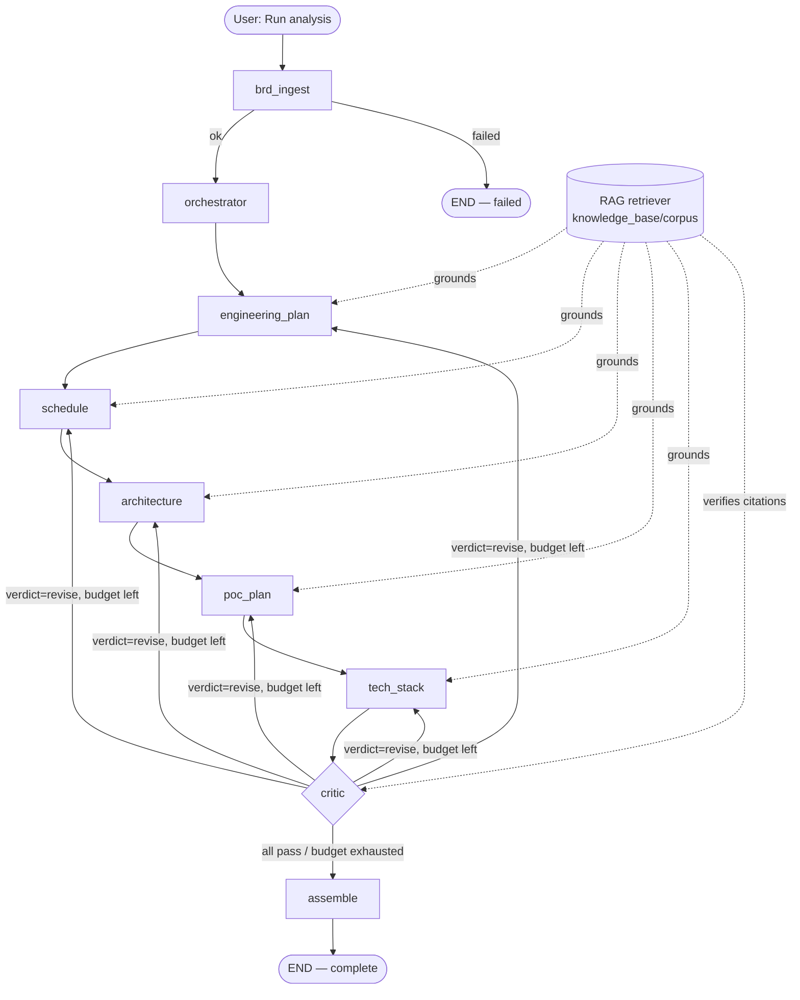

# BRD Dev Agent

> A multi-agent workflow that turns a **Business Requirements Document**
> into a delivery package — engineering plan, schedule, solution architecture,
> PoC plan, and technology-stack options — each scored and revised before it
> reaches the Engineering Manager.
>
> LangGraph · OpenAI `gpt-4.1` · Retrieval-Augmented Generation · Streamlit

---

## What it does

1. **Ingest & parse** — reads a BRD (`.md` / `.txt` / `.docx` / `.pdf`), scans
   and redacts confidentiality-sensitive content (credentials, PII) before
   anything reaches a model call, splits it into sections, classifies each
   requirement (functional / non-functional / constraint / assumption /
   out-of-scope, priority, NFR category, ambiguity), and tags project
   metadata.
2. **Ground everything (RAG)** — every agent is grounded in a knowledge base of
   past deliveries, templates, architecture patterns, estimation heuristics, and
   org standards (`knowledge_base/corpus/`).
3. **Generate (5 specialist agents)** — Engineering Plan (with a Reflection
   self-review step), Schedule Estimator, Solution Architect, PoC Planner, Tech
   Stack Recommender. Every output is validated against a pydantic schema
   (retried once on failure) plus deterministic cross-agent contract checks
   (e.g. a PoC module must map to a real Architecture component).
4. **Validate & evaluate** — one Critic scores each deliverable on
   completeness · consistency · actionability · groundedness, enforces a
   per-agent revision loop, and assigns 🟢 / 🟡 / 🔴 quality badges.
5. **Assemble** — compiles a single Markdown BRD response document with a quality
   scorecard.

---

## Architecture

Streamlit UI ──► LangGraph pipeline (SqliteSaver checkpoints), nine nodes
sharing one state object: eight LLM-backed agents plus a deterministic
assembler.



A revised specialist routes straight back to the Critic, not the next stage
in the chain. Full rationale for each node — orchestration pattern choices,
schema contracts, the revision loop's scoring — is in
[TECHNICAL_DESIGN.md](TECHNICAL_DESIGN.md) §3.

A **node** is one step in the graph: a function that reads the shared state and
returns changes to it. An **agent** is a node that calls an LLM — `assemble` does
not, so it is the one node that isn't counted as an agent. The order is fixed in
code (see the diagram); the only dynamic routing is the Critic sending a failing
specialist back for revision.

| # | Node | Agent? | What it does | LLM calls |
| --- | --- | --- | --- | --- |
| 1 | `brd_ingest` | Yes | Loads the BRD, redacts credentials/PII, splits it into sections, classifies each requirement (type, priority, NFR category, ambiguity) and tags project metadata | One per section, plus one for metadata (`gpt-4.1-mini`) |
| 2 | `orchestrator` | Yes | Decides which sections each specialist sees (`routing_map`) and writes a 2–3 sentence BRD summary that drives the RAG queries; on a Critic revision it just passes through to the failing specialist | One (the summary) — routing is plain Python; none on a revision re-entry |
| 3 | `engineering_plan` | Yes | Phases, risks, milestones and team — drafted, self-reviewed (Reflection), then revised if the review asks | Up to three: draft, review, revise |
| 4 | `schedule` | Yes | Effort, timeline, resource matrix and critical path; its phases must match the plan's | One |
| 5 | `architecture` | Yes | Components, data flows, NFR mapping, key decisions and a Mermaid diagram | One |
| 6 | `poc_plan` | Yes | A falsifiable goal, modules mapped to real architecture components, measurable success criteria, checked against existing Jira tickets | One, plus a tool-call loop (up to 4 hops) against Jira |
| 7 | `tech_stack` | Yes | 2–3 stack options with trade-offs and a recommendation, checked against the org tech radar | One, plus a tool-call loop (up to 6 hops) against the radar |
| 8 | `critic` | Yes | Scores each deliverable on completeness, consistency, actionability and groundedness, applies the deterministic caps, picks at most one agent to revise, and assigns 🟢 / 🟡 / 🔴 badges | One per artifact scored |
| 9 | `assemble` | **No** | Compiles the scored deliverables into one Markdown response document with a quality scorecard and revision-improvement table, and saves the report, manifest and bundled JSON | None — deterministic |

---

## Quick start

Requires **Python 3.12** (`brew install python@3.12`).

```bash
cp .env.example .env          # set OPENAI_API_KEY
chmod +x run.sh

./run.sh                      # Streamlit UI at http://localhost:8501
./run.sh cli data/sample_brds/payments_reconciliation_brd.md   # headless run
./run.sh test                 # pytest
```

`run.sh` finds Python 3.12 (override with `PYTHON=/path/to/python3.12 ./run.sh`),
creates a venv, installs `requirements.txt`, and builds the RAG index
(`scripts/build_index.py`) on first run. If an existing `venv/` was built with a
different Python version it is rebuilt automatically.

### Configuration

- `config/llm_config.yaml` — provider (`openai`), model (`gpt-4.1`; `brd_ingest`
  uses `gpt-4.1-mini`), per-agent temperature, revision budget, RAG settings.
- `config/brd_config.yaml` — Critic rubric weights, badge thresholds, required
  deliverable sections, output paths.
- `.env` — `OPENAI_API_KEY`, optional `LANGCHAIN_*` for LangSmith tracing,
  runtime paths (`VECTORSTORE_DIR`, `CHECKPOINT_DB`, `ARTIFACT_STORE`).

---

## Knowledge base

Add your organization's material under `knowledge_base/corpus/`:

```
corpus/past_brds/       historical BRDs + their delivered plans
corpus/templates/       plan / architecture / PoC / response templates
corpus/patterns/        architecture patterns, estimation heuristics
corpus/org_standards/   tech radar, security baseline, NFR catalogue, SDLC policy
```

Then rebuild: `python scripts/build_index.py --force`.

---

## Outputs

```
output/parsed/<brd_id>_parsed.json            parsed sections + requirements + metadata
output/deliverables/<agent>.json              each specialist's artifact
output/reports/<brd_id>_response.md            the assembled BRD response document
output/reports/<brd_id>_deliverables.json      all deliverables bundled
```

---

## Tests

```bash
pytest tests/ -q
```

All LLM and RAG calls are stubbed; `tests/test_workflow_smoke.py` runs the full
compiled graph end to end.

---

## Evaluation

Unit tests stub every LLM call; the evaluation set runs the real pipeline
against real BRDs to check the *system's* behavior, not just the code's.

`data/eval_brds/labels.yaml` labels 8 BRDs (the 2 samples above plus 6 new
ones under `data/eval_brds/`) with the edge case each is designed to stress —
ambiguous/hedged requirements, directly conflicting NFRs, an oversized
multi-service migration, a minimal 2-requirement BRD, regulatory/compliance
depth, and integration variety (SOAP, batch files, REST, a message queue) —
plus what the pipeline is expected to do with each one.

```bash
python scripts/run_eval.py                                    # the whole set
python scripts/run_eval.py --only AMBIGUOUS_ANALYTICS,CONFLICTING_NFRS
```

Writes `output/eval/<run_id>/summary.md` — per-BRD stage/requirement counts
and whether its expectations were met, plus every agent's Critic scores and
revision count. Exits non-zero on any unmet expectation (pipeline didn't
complete, too few requirements found, ambiguity wasn't flagged), so it's
CI-usable on a prompt or config change; quality scores are always reported,
never pass/fail on their own — a lower score is data about the system, not a
bug in the check. Compare two run_ids' `summary.json` for real before/after
numbers across a change.

---

## Deployment

See [infra/DEPLOY.md](infra/DEPLOY.md) — Azure Container Apps (single
always-on web process), two Azure Files shares (`vectorstore`, `output`;
the LangGraph checkpoint DB deliberately lives on local container disk
instead — SQLite's file locking is unreliable over SMB), Key Vault (RBAC)
for secrets, GitHub Actions (OIDC) for CI/CD with a `test` job (lint + full
suite) gating every deploy. Bicep + `azd` supported.
