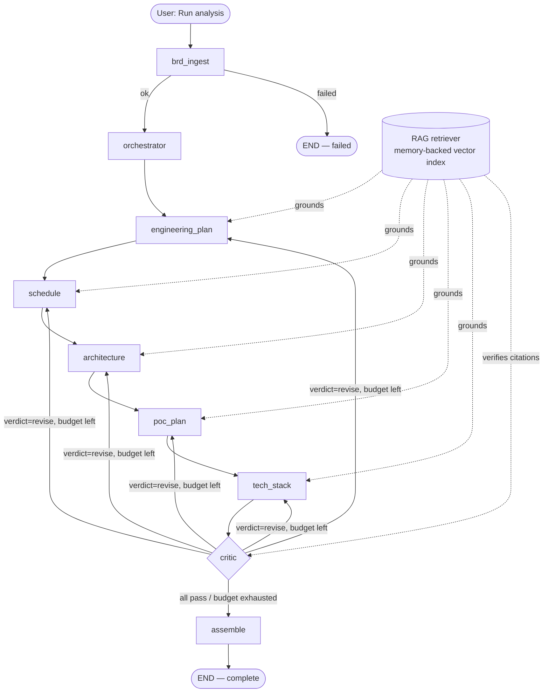

# Technical Design Document — IK BRD Dev Agent

> Status: reflects the codebase as of 2026-09-16. This document describes what is
> actually implemented and running (verified against live Azure deployment and
> the test suite), not a plan for what would eventually be built. Where a
> deliberate trade-off was made, the reasoning is stated inline rather than left
> implicit — this doc is meant to survive the next person asking "why is it built
> this way."

## 1. Purpose & Audience

This document is the engineering reference for **Charter** (internal name: IK BRD
Dev Agent) — an autonomous multi-agent system that turns a Business Requirements
Document into a scored, delivery-ready plan. It is written for engineers who need
to extend, debug, or operate the system, and assumes familiarity with Python,
LLM-based agent systems, and basic LangGraph concepts. For a product-level
explanation see [README.md](README.md); for the original implementation plan
(now historical) see [PLAN.md](PLAN.md).

## 2. System Overview

**Input:** a Business Requirements Document (`.md`, `.txt`, `.docx`, `.pdf`).

**Output:** five scored deliverables — Engineering Plan, Schedule, Solution
Architecture, PoC Plan, Technology Stack Options — assembled into one Markdown
response document with a quality scorecard, typically produced in 8–10 minutes.

**Core mechanism:** a fixed pipeline of eight LangGraph nodes (one ingestion
agent, one orchestrator, five specialist generators, one critic, one assembler)
sharing a single mutable state object. Every specialist call is grounded in a
retrieval-augmented knowledge base, validated against a deterministic schema,
and subject to a Critic-driven revision loop with a bounded budget.

**Why this shape:** the four capabilities the product needs — parse a BRD,
ground answers in org knowledge, generate multiple coordinated deliverables,
and validate/improve them — map cleanly onto four architectural disciplines
(ingestion, RAG, multi-agent orchestration, evaluation), and each discipline is
a separately swappable layer. Swapping the RAG backend (memory → Chroma) or
adding a sixth specialist doesn't touch the other three disciplines.

## 3. Architecture

*A revised specialist routes straight back to the Critic (not the next stage in
the chain) — see §8, step 9h.*

### 3.1 Orchestration pattern

This isn't one textbook pattern; it's five composed, each solving a different
part of the coordination problem:

| Pattern | Where | Why |
|---|---|---|
| **Prompt-chaining / DAG** | `engineering_plan → schedule → architecture → poc_plan → tech_stack` | Each specialist's output is real input to the next (schedule reads the plan's phases; PoC reads the architecture's components) — a fixed sequence, not a dynamic dispatch, because the dependency order is always the same. |
| **Orchestrator–Workers** | `orchestrator_node` → five specialists | The orchestrator does static routing (which BRD sections matter to which specialist) once, up front — it does not re-plan or supervise mid-run. |
| **Evaluator–Optimizer** | `critic_node` ↔ specialist re-entry | The Critic is a real evaluator with a bounded optimize loop (`max_revisions_per_agent`), not a rubber stamp — see §3.3. |
| **Reflection** | inside `engineering_plan_node` | Draft → self-review → conditional revise, all before the Critic ever sees it — the one specialist complex enough (7 sub-fields, cross-cutting risk register) to warrant self-checking before external review. |
| **Blackboard** | `BRDState` | All nine nodes read and write one shared, typed state object via LangGraph's state-merge semantics — no node calls another directly or passes messages peer-to-peer. |

### 3.2 Structured output contracts

Every specialist agent returns JSON declared as prompt text (see each agent's
`_SCHEMA`/`_SYSTEM` block) **and** enforced by a real pydantic model
(`skills/schemas.py`). `invoke_json()` (`agents/specialist_base.py`) folds three
independent checks into one retry budget:

1. **JSON syntax** — `skills/json_utils.py::extract_json()` (fence-stripping,
   brace-matching fallback).
2. **Schema shape** — `schema.model_validate(data)`; a missing required field or
   wrong type is a validation failure, not a silent pass-through.
3. **Cross-agent contract** (where applicable) — a deterministic `extra_check`
   callable. Two exist today: the PoC Planner's `maps_to_component` must name a
   real Solution Architect component (`agents/poc_planner_agent.py::
   _check_component_contracts`), and the Tech Stack Recommender's chosen
   technologies must not be HOLD/RETIRE on the real tech radar
   (`agents/tech_stack_agent.py::_check_radar_compliance`).

On any of the three failing, the exact problem is fed back to the model as a
follow-up turn and retried **once**. If it still fails, the agent is marked
`ArtifactStatus.FAILED` and the pipeline continues — see §3.4.

### 3.3 The Critic and revision loop

One node (`agents/critic_agent.py`) scores every artifact that has never been
scored, or was revised since its last score, on four dimensions —
completeness · consistency · actionability · groundedness — via one LLM call
per artifact plus two **deterministic** overrides applied in Python, not
trusted to the model:

- Missing required sections (`config/brd_config.yaml::required_sections`) caps
  `completeness` at 0.45.
- Zero citations caps `groundedness` at 0.5.

`overall` is a configured weighted sum (`rubric_weights`, must total 1.0) —
arithmetic the LLM never touches. If `overall < min_pass_score` (default 0.75)
or any single dimension is below 0.5, the verdict is `REVISE`.

Each critic pass picks **at most one** revision target: the earliest-in-
pipeline-order agent with a `REVISE` verdict and remaining budget
(`max_revisions_per_agent`, default 2). That agent's node is re-entered
directly — `revision_issues()` feeds it the Critic's issue list, and
`finish()` detects the re-entry (`state["pending_revision"] == agent_key`) and
routes straight back to the Critic instead of the next pipeline stage. This
bounds the loop to at most `5 agents × 2 revisions = 10` extra hops, reflected
in `RECURSION_LIMIT = 60`.

### 3.4 Failure policy: non-blocking

No single specialist failing aborts the run. `fail()` (`specialist_base.py`)
records `ArtifactStatus.FAILED` and an error string, and the pipeline still
reaches `assemble`, which renders `_Not produced — the responsible agent
failed._` for that section and includes the failure in the assembled doc's
error trail. Only an **ingestion** failure (`route_after_ingest`) ends the run
early — there is nothing downstream to build on without parsed requirements.

## 4. Technology Stack

| Layer | Choice | Notes |
|---|---|---|
| LLM | OpenAI `gpt-4.1` (`gpt-4.1-mini` for ingestion) | Per-agent model override in `config/llm_config.yaml`; `OPENAI_MODEL` env var overrides the *default*, never a per-agent setting — see `skills/llm_factory.py::resolve_llm_params` precedence. |
| Orchestration | LangGraph `StateGraph` + `SqliteSaver` | Checkpointed per `thread_id`; see §7 for the concurrency design. |
| Embeddings | OpenAI `text-embedding-3-large` | Via `skills/llm_factory.py::get_embeddings`. |
| RAG store | Custom in-memory JSON index (`vectorstore/index.json`) | Cosine similarity via numpy; Chroma is a swappable, currently-inactive alternate backend (`RAG_BACKEND=chroma`). |
| Structured output | `pydantic` v2 models (`skills/schemas.py`) | Lenient (`extra="allow"`) beyond identifying fields. |
| Tool-calling | LangChain `bind_tools` | One real tool today: `check_tech_radar_status` (`agents/tech_stack_agent.py`), backed by a real parser over `knowledge_base/corpus/org_standards/tech_radar.md`. |
| UI | Streamlit, `st.navigation` | Background-thread job runner (§6.1) decouples pipeline execution from the Streamlit script lifecycle. |
| Tracing | LangSmith (optional) | Auto-detected from `.env`; see `_configure_langsmith()`. |
| Deployment | Azure Container Apps | Single always-on instance; see §9. |
| Tests | pytest, 166 tests | Every LLM/RAG call stubbed; `tests/test_workflow_smoke.py` runs the real compiled graph end-to-end. |

## 5. Data Model

`orchestration/state.py` defines one `BRDState` TypedDict every node reads and
writes a partial delta of (LangGraph merges deltas into the running state —
nodes never see or mutate the whole object directly, they return what changed).

| Field | Type | Written by |
|---|---|---|
| `brd_text`, `brd_sections`, `requirements`, `brd_metadata` | str / `List[BRDSection]` / `List[Requirement]` / dict | `brd_ingest` |
| `brd_summary`, `agent_plan`, `routing_map` | str / list / dict | `orchestrator` |
| `engineering_plan` … `tech_stack` | `Optional[AgentArtifact]` (5 fields) | each specialist |
| `critic_scores`, `revision_counts`, `pending_revision` | dict / dict / `Optional[str]` | `critic` |
| `brd_response_doc`, `quality_badges` | str / dict | `assemble` |
| `current_stage`, `current_step`, `errors`, `messages` | `Stage` / str / list / list | every node |

`AgentArtifact` is the uniform envelope every specialist returns: `agent`,
`content` (the schema-validated deliverable dict), `citations`, `revision`,
`self_review`, `status` (`ArtifactStatus`: `OK` / `FAILED` / `PENDING`).

`CriticScore` holds the four dimension scores, `overall`, `verdict`
(`Verdict.PASS`/`REVISE`), `issues`, `badge` (`Badge.GREEN`/`AMBER`/`RED`), and
`scored_revision` (which `AgentArtifact.revision` this score was computed
against — how the Critic knows an artifact is "dirty" and needs re-scoring).

**A recurring gotcha:** `Stage`, `Badge`, `ArtifactStatus`, `Verdict` are all
`(str, Enum)`. They compare and hash correctly against plain strings
(`Stage.COMPLETE == "complete"` is `True`), but calling `str()` on one invokes
`Enum.__str__` and returns `"Stage.COMPLETE"`, not `"complete"` — the `str`
mixin does not win over the Enum's own override. Every place that needs the
plain value for display or a JSON key (`streamlit_app/jobs.py::_stage_str`,
`scripts/run_eval.py::_plain`) does `value.value if hasattr(value, "value")
else value`, not `str(value)`. This was a real, shipped bug (surfaced as
`"Stage.Ingest"` in the UI) before the fix — worth knowing before adding a new
place that stringifies one of these enums.

## 6. Component Deep-Dive

### 6.1 UI & background execution (`streamlit_app/`)

Streamlit cancels an in-flight script on any new user interaction — the
original UI would grey out mid-run if the user touched anything. The fix
(`streamlit_app/jobs.py`) decouples execution from the script lifecycle
entirely: `start_job()` spawns a daemon `threading.Thread` running the
pipeline and returns a `job_id` immediately; job state lives in small JSON
files under `output/jobs/`, not `st.session_state`, so any session (this tab,
a fresh tab, a page reload) can poll and adopt an in-flight job. Live progress
during a run comes from reading LangGraph's own SqliteSaver checkpoint for
that `thread_id` (`jobs.live_stage()` → `get_thread_state()`) — no separate
progress-tracking mechanism to keep in sync.

The progress UI itself is a real `st.dialog` modal (`lib.py::_progress_dialog`)
that self-refreshes every 2 seconds via `time.sleep(2); st.rerun()`, showing a
progress bar, elapsed time, and the full stage stepper. It's dismissible —
closing it swaps in a slim one-line banner with a "View progress" button,
tracked via `st.session_state.progress_dialog_open`, so browsing away never
re-traps the user behind the modal.

### 6.2 Ingestion & parsing (`skills/brd_parser.py`, `agents/brd_ingest_agent.py`)

`load_document()` dispatches on file extension (`.md`/`.txt` read directly;
`.docx` via `python-docx`, converting heading styles to Markdown `#`s so
downstream section detection is format-agnostic; `.pdf` similarly). Section
detection (`extract_sections`) recognizes three heading conventions — Markdown
`#`, numbered (`"3.1 Title"`), and short ALL-CAPS lines — gated by
`_looks_like_title()`, which rejects anything sentence-punctuated or
containing a requirement verb, so a numbered requirement sentence ("3.1 The
system must...") is never misclassified as a section heading.

Requirement classification and metadata tagging are both single LLM calls per
section/document on `gpt-4.1-mini` (the one agent deliberately on a cheaper
model — see `config/llm_config.yaml`), parsed via the shared
`skills/json_utils.py::extract_json`.

### 6.3 RAG / Knowledge Augmentation (`skills/rag_retriever.py`)

The corpus (`knowledge_base/corpus/{past_brds,templates,patterns,
org_standards}/`) is chunked by paragraph-packing with a character-approximated
token budget (`chunk_text`, default 800 tokens / 100 overlap), embedded once,
and persisted as `vectorstore/index.json` — `{chunks, vectors}`, rebuilt only
when `corpus_hash()` changes (a build step, `scripts/build_index.py`, not
something that runs per-request). Retrieval is plain numpy cosine similarity
(`retrieve()`) — no external vector DB; Chroma exists as an alternate backend
behind `RAG_BACKEND=chroma` but is not the active path.

`retrieve_for_agent()` composes an agent-specific query from the BRD summary
and routed requirements, then applies `AGENT_DOC_WEIGHTS` — a per-agent
multiplier on similarity score by doc type (e.g. the Tech Stack Recommender
weights `org_standard` 1.4×, since the tech radar lives there; the Engineering
Plan Generator weights `template` 1.35×). Citations the specialists emit
(`"KB:<doc>#<n>"`) are later resolved back to their real chunk text by the
Critic (`resolve_citations`) — grounding is checked against what the KB
actually says, not trusted from the citation string alone.

### 6.4 Specialist agents (`agents/*_agent.py`, shared via `specialist_base.py`)

All five follow the same shape: gather routed requirements + RAG grounding +
persona → build a system/user prompt with an inline JSON schema →
`invoke_json()` (parse + validate + one retry) → `finish()`/`fail()`. Per-agent
specifics:

| Agent | Schema (`skills/schemas.py`) | Distinguishing behavior |
|---|---|---|
| Engineering Plan Generator | `EngineeringPlan` | Draft → LLM self-review (`_reflect`) → conditional revise, all in one node — the only agent with an internal Reflection loop. |
| Schedule Estimator | `Schedule` | Reads the plan's `phases`/`team_composition` directly; sets `alignment_ok=False` + `alignment_notes` if it must deviate rather than silently diverging. |
| Solution Architect | `SolutionArchitecture` | Every `nfr_category` requirement must appear in `nfr_mapping`; emits a Mermaid diagram, sanitized by `skills/mermaid_utils.py` before rendering. |
| PoC Planner | `PocPlan` | `extra_check=_check_component_contracts` — the one agent with a cross-agent deterministic guardrail. |
| Tech Stack Recommender | `TechStack` | Real tool-calling (`_gather_tech_radar_findings`) before drafting, plus `extra_check=_check_radar_compliance` enforcing its own "never HOLD/RETIRE" rule deterministically. |

### 6.5 Assembly (`agents/assemble_agent.py`)

Pure rendering — no LLM call. Each deliverable has a dedicated `_render_*`
function producing Markdown tables from its `content` dict; the overall badge
is a Python rollup (`_rollup_badge`: red if any red, else amber if any amber,
else green — never computed by a model). Writes three files per run:
`<brd_id>_response.md` (the human-facing doc), `_deliverables.json` (all five
artifacts bundled), and `_manifest.json` (a lightweight index record — scores,
badges, counts — that powers the Run History view without re-parsing the full
bundle).

## 7. Persistence & Checkpointing

LangGraph's `SqliteSaver` checkpoints the full state after every node, keyed by
`thread_id` — this is what makes live progress polling and (via the CLI)
`resume_thread` possible.

**A real concurrency bug and its fix, worth understanding before touching this
code:** the Pregel loop dispatches checkpoint reads/writes from its own
internal worker thread(s), even within one synchronous `.invoke()` call — not
necessarily the thread that called `.invoke()`. An earlier fix attempt gave
each *external* caller thread (the background job thread, the UI's polling
thread) its own SQLite connection — this broke immediately with `SQLite
objects created in a thread can only be used in that same thread`, because
LangGraph's *internal* threads don't match either. The correct fix
(`_get_checkpointer()` in `orchestration/langgraph_workflow.py`) is a single
shared connection with `check_same_thread=False` — the pattern `SqliteSaver`
is actually designed around — plus `timeout=30` / `PRAGMA busy_timeout=30000`
so the real, brief overlap between the job thread's writes and the UI's reads
resolves via retry instead of failing. That retry only works reliably because
`CHECKPOINT_DB` is **local container disk**, not the Azure Files share the
vector index and `output/` also use — SQLite's locking is unreliable over SMB
(no reliable lock-release signal for a retry to wait on), which is why
`infra/main.bicep` deliberately does not mount `checkpoints` on the shared
Azure Files volume (see §9).

## 8. End-to-End Technical Flow: Click to Completion

This traces every method actually invoked, in order, from the user clicking
**Run analysis** to the completed result appearing in the UI. File paths are
relative to the repo root.

**1. Click** → `streamlit_app/views/upload.py` (or `dashboard.py`) calls
`run_analysis(uploaded_file=..., pasted_text=..., sample_name=...)` in
`streamlit_app/lib.py`.

**2. `run_analysis()`** (`streamlit_app/lib.py`):
   - `api_key_present()` — fails fast if `OPENAI_API_KEY` is unset.
   - **Validation** (before any job starts): size cap (`MAX_UPLOAD_BYTES`,
     15MB) and empty-file check on upload; a 200-character content floor
     (`MIN_BRD_CHARS`) on the decoded/extracted text. For `.docx`/`.pdf`, the
     file is written to a temp path and run through the *real*
     `skills.brd_parser.load_document()` right here — a validation pass is a
     guarantee the pipeline can read the file, not a separate looser check.
   - `_derive_brd_id(filename)` — a readable id from the real filename.
   - `streamlit_app.jobs.start_job(brd_path=..., brd_text=..., brd_id=...)`.

**3. `jobs.start_job()`** (`streamlit_app/jobs.py`):
   - Generates `job_id` (`uuid4().hex[:12]`) and `thread_id` (`uuid4()`).
   - `_write()` an initial record (`status: "running"`) to
     `output/jobs/<job_id>.json` (atomic: write to `.tmp`, then `replace()`).
   - Spawns `threading.Thread(target=_run, args=(job_id, brd_path, brd_text,
     brd_id, thread_id), daemon=True).start()`.
   - Returns `job_id` **immediately** — the calling script is not blocked.

**4. Back in `run_analysis()`**: sets `st.session_state.active_job_id`,
   `brd_running = True`, `progress_dialog_open = True`, shows a toast, returns
   `True`. The view calls `st.rerun()`.

**5. `render_job_watcher()`** (`streamlit_app/lib.py`, called at the top of
   every page): sees the running job via `session_state.active_job_id` (or
   `jobs.latest_job()` for a fresh session adopting someone else's run), calls
   `jobs.get_job(job_id)`, and — since `progress_dialog_open` is true — opens
   `_progress_dialog(job)`, a `@st.dialog` modal. It reads `jobs.live_stage(job)`,
   renders the stage stepper and progress bar, and calls `time.sleep(2);
   st.rerun()` to refresh itself. This loop runs independently of the pipeline
   below — dismissing it or navigating away does not affect the background
   thread.

**6. Meanwhile, in the background thread — `jobs._run()`**: lazily imports and
   calls `orchestration.langgraph_workflow.run_pipeline(brd_path=..., brd_text=...,
   brd_id=..., thread_id=...)`.

**7. `run_pipeline()`** (`orchestration/langgraph_workflow.py`):
   - Sets up a per-run log file handler.
   - `load_configs()` — merges `config/brd_config.yaml` and
     `config/llm_config.yaml` (the latter nested under `_llm_config`).
   - `application = get_app()` — lazily builds the process-singleton compiled
     graph on first call: `build_workflow(checkpointer=_get_checkpointer())`
     (§7 explains the connection design).
   - `initial = make_initial_state(brd_id, thread_id, framework_config,
     brd_path, brd_raw_text)` — a fresh `BRDState`.
   - `final = application.invoke(initial, {"configurable": {"thread_id":
     thread_id}, "recursion_limit": 60})` — **this is where the graph actually
     runs.** Every step below happens inside this one call; LangGraph invokes
     each node function with the current merged state, merges the returned
     delta back in, checkpoints to SQLite, and follows the routing function
     to the next node.

**8. Node 1 — `brd_ingest_node`** (`agents/brd_ingest_agent.py`):
   - `load_document(brd_path)` if no raw text was supplied (§6.2).
   - `extract_sections(raw_text)`; aborts (`Stage.FAILED`) if fewer than
     `min_sections` are found.
   - `get_llm("brd_ingest", llm_config)` (gpt-4.1-mini) →
     `classify_requirements(sections, llm)` (one call per section) and
     `tag_metadata(sections, llm)` (one call).
   - `_persist(...)` writes `output/parsed/<brd_id>_parsed.json`.
   - Returns `brd_text`, `brd_sections`, `requirements`, `brd_metadata`,
     `current_stage=Stage.ORCHESTRATE`.
   - **Router** `route_after_ingest`: `Stage.FAILED` → graph `END`;
     otherwise → `orchestrator`.

**9. Node 2 — `orchestrator_node`** (`agents/orchestrator_agent.py`):
   - `agent_plan = list(SPECIALIST_AGENTS)` (fixed order).
   - `routing_map = _build_routing_map(sections, requirements)` — maps each
     specialist to the `section_id`s most relevant to it (by requirement
     type/priority/ambiguity).
   - `brd_summary = _summarize(...)` — one LLM call (`get_llm("orchestrator",
     ...)`, temp 0.0), with a deterministic fallback if it errors.
   - Returns `agent_plan`, `routing_map`, `brd_summary`,
     `current_stage=Stage.PLAN`.
   - **Router** `route_after_orchestrator`: no `pending_revision` on a first
     pass → always `engineering_plan`.

**9a. Node 3 — `engineering_plan_node`** (`agents/engineering_plan_agent.py`):
   - `grounding_for(state, "engineering_plan")` →
     `get_retriever(llm_config).retrieve_for_agent(...)` (§6.3) — embeds the
     query, cosine search, formats `[KB:doc#n]` blocks.
   - **Draft**: `invoke_json("engineering_plan_generator", state,
     DRAFT_SYSTEM, user, schema=EngineeringPlan)` (`specialist_base.py`) —
     `get_llm(...).invoke(...)` → `extract_json` → `EngineeringPlan.
     model_validate()`; one retry with the exact problem fed back if JSON
     parsing or schema validation fails.
   - **Reflect**: `_reflect(state, draft)` — a second LLM call scoring the
     draft (`{"issues": [...], "verdict": "ok"|"revise"}`).
   - **Revise** (only if `verdict == "revise"`): a third `invoke_json()` call
     with the issues fed back, same schema.
   - `finish("engineering_plan", final, state, Stage.SCHEDULE,
     self_review=review)` — pops `citations`, wraps in `AgentArtifact`,
     `_save()` writes `output/deliverables/engineering_plan.json`.
   - **Router** `route_after_specialist` (shared by all five specialists,
     dispatching purely on `current_stage` via `_STAGE_TO_NEXT`) → `schedule`.

**9b–9d. Nodes 4–6** — `schedule_estimator_node`, `solution_architect_node`,
   `poc_planner_node` (`agents/schedule_estimator_agent.py`,
   `solution_architect_agent.py`, `poc_planner_agent.py`): the same
   grounding → `invoke_json(schema=...)` → `finish()` shape, each reading the
   prior specialists' artifacts directly from state (schedule reads the plan's
   phases; PoC reads the architecture's components). `poc_planner_node`'s
   `invoke_json` call additionally passes `extra_check=
   _check_component_contracts` — every `maps_to_component` is checked against
   the Solution Architect's real component names, folded into the same retry.
   → `Stage.ARCHITECTURE` → `Stage.POC` → `Stage.TECH_STACK`.

**9e. Node 7 — `tech_stack_node`** (`agents/tech_stack_agent.py`):
   - `_gather_tech_radar_findings(get_llm(...), user)` — **real LLM-native
     tool-calling**: `llm.bind_tools([check_tech_radar_status])`, loop while
     `resp.tool_calls`, executing `check_tech_radar_status.invoke(args)` →
     `skills/tech_radar.py::lookup_tech_radar_status()` (a real parser over
     `knowledge_base/corpus/org_standards/tech_radar.md`, not a mock). Fails
     soft — an unbound-tools test double or a tool-call error just skips this
     step, falling back to plain KB grounding.
   - `invoke_json(..., schema=TechStack, extra_check=_check_radar_compliance)`
     — every named technology across every option's layers is checked against
     the real radar; a HOLD/RETIRE match is fed back and retried.
   - → `Stage.CRITIQUE`.
   - **Router**: last specialist's `Stage.CRITIQUE` → `critic`.

**9f. Node 8 — `critic_node`** (`agents/critic_agent.py`):
   - `_dirty_agents()` — artifacts never scored, or revised since their last
     score.
   - Per dirty agent, `_score_artifact()`: `_missing_sections()` (deterministic
     required-key check), `_resolve_citations()` (via
     `get_retriever().resolve_citations()` — verified against real KB text),
     one LLM call (`get_llm("critic", ...)`) for the four dimension scores +
     issues, then the two deterministic overrides (§3.3), then `_make_score()`
     — Python-computed `overall`/`verdict`/`badge`.
   - `_pick_revision_target()` — earliest agent (pipeline order) with
     `verdict=REVISE` and budget remaining.
   - **If a target exists**: `pending_revision = target`,
     `current_stage = Stage.CRITIQUE`. **Router** `route_after_critic` sends
     control directly to that agent's own node — re-entering step 9a–9e's
     node function, which now sees `revision_issues()` non-empty, feeds them
     into its prompt, and on `finish()` detects `pending_revision ==
     agent_key` and routes straight back to `critic` (`current_step =
     "<agent>_revised"`) instead of the next pipeline stage. This loop repeats
     until every artifact passes or exhausts its budget.
   - **If no target remains**: `current_stage = Stage.ASSEMBLE`. **Router** →
     `assemble`.

**9g. Node 9 — `assemble_node`** (`agents/assemble_agent.py`): pure
   rendering, no LLM call. `_rollup_badge()` (Python, not model-computed);
   each deliverable through its dedicated `_render_*` function; `_save()`
   writes `output/reports/<brd_id>_{response.md,deliverables.json,
   manifest.json}`. Returns `current_stage = Stage.COMPLETE`. Graph edge
   `assemble → END`.

**10. `application.invoke()` returns** the final merged `BRDState` to
   `run_pipeline()`, which logs a per-agent summary and returns it to
   `jobs._run()`.

**11. `jobs._run()`** writes the final record (`status: "complete"` or
   `"failed"`, `overall_badge`, `finished_at`) to `output/jobs/<job_id>.json`.
   The daemon thread ends.

**12. Meanwhile, throughout steps 8–11**, `_progress_dialog()`'s 2-second
   self-rerun loop has been calling `jobs.live_stage(job)` →
   `orchestration.langgraph_workflow.get_thread_state(thread_id)` →
   `get_app().get_state({"configurable": {"thread_id": thread_id}})` — reading
   the **latest SqliteSaver checkpoint** for that thread on every poll. This is
   how the UI shows live stage progress without any separate progress-tracking
   channel between the background thread and the UI.

**13. On the next poll after completion**, `jobs.get_job(job_id)["status"]` is
   no longer `"running"` — `render_job_watcher()`'s "just finished" branch
   fires: resets `active_job_id`/`brd_running`, and on success calls
   `load_historical_run(brd_id)` (reads the manifest/deliverables back off
   disk) to populate `st.session_state.brd_result`, appends to
   `run_history`, and shows a success toast with the overall badge; on
   failure, shows the recorded error. The modal closes (it is only invoked
   while `status == "running"`).

**14. The user now sees results** across Dashboard, Parsed Requirements,
   Deliverables, Quality Report, and Export — all reading from
   `st.session_state.brd_result`, populated once in step 13.

## 9. Deployment Architecture (Azure)

Single always-on Azure Container App (`minReplicas = maxReplicas = 1` —
Streamlit session state and the SQLite checkpointer are single-instance by
design; see `infra/main.bicep`). Two Azure Files shares (`vectorstore`,
`output`) persist the RAG index and deliverables across restarts; the
checkpoint DB deliberately lives on local container disk instead (§7). Key
Vault (RBAC) holds `OPENAI-API-KEY`/`LANGCHAIN-API-KEY`, granted only to the
app's managed identity. `APP_BUILD` is derived from the image tag at deploy
time (`last(split(containerImage, ':'))`) so the footer always shows the
actual running build. Full provisioning/deploy commands: `infra/DEPLOY.md`.

## 10. Testing & Evaluation

**Unit/integration tests** (`tests/`, 166 tests, `pytest tests/ -q`): every LLM
and RAG call is stubbed (`FakeLLM` in `conftest.py`); `test_workflow_smoke.py`
runs the real compiled graph end-to-end including the revision loop.

**Evaluation set** (`data/eval_brds/`, `scripts/run_eval.py`): 8 labeled BRDs —
2 clear baselines plus 6 built to stress a specific edge case (ambiguous/hedged
language, directly conflicting NFRs, an oversized 22-requirement migration, a
2-requirement sparse BRD, regulatory/compliance depth, five-shape integration
variety). Runs the *real* pipeline and checks actual behavior — requirement
counts, ambiguity flagging, completion — against each BRD's `expect` block,
independent of and complementary to the Critic's own per-run scoring. See
`README.md#evaluation`.

## 11. Operationalization & Pre-Release Gates

Two questions this section answers: what does "working" mean for this system
at each level (not just "the Critic gave it a green badge"), and what has to
be true before a change is allowed to reach production.

### 11.1 Success and failure criteria, by level

| Level | Success | Failure |
|---|---|---|
| **Artifact** (one specialist's output) | Critic `verdict = pass`, badge green/amber | badge red, or `status = failed` after exhausting `max_revisions_per_agent` |
| **Run** (one BRD end to end) | `current_stage` reaches `Stage.COMPLETE`; every one of the 5 specialist artifacts has `status = ok` | pipeline lands in `Stage.FAILED`, or completes with one or more artifacts still `failed` |
| **Eval set** (`scripts/run_eval.py`, 8 labeled BRDs) | every BRD's `expect` block passes (0 `expectation_failures`) — see §10 | any BRD fails its structural expectation (wrong stage, too few requirements, ambiguity under-flagged) |
| **Release** (a merged change) | all gates in §11.2 pass | any gate fails — the change does not go out |
| **Live service** | `GET /` on the deployed URL returns `HTTP 200`; `APP_BUILD` matches the image tag just deployed | non-200 response, or `APP_BUILD` stuck on a previous tag (a real bug hit and fixed this session — the badge silently went stale after a CI-driven image update that didn't also update the env var) |

These were previously implicit (scattered across Critic verdicts and ad hoc
manual checks during each deploy); this table is the first place they're
stated as explicit, checkable targets rather than only inferred from logs.

### 11.2 Pre-release gate checklist

Run in order; a failure at any step blocks the release. Step 1 is enforced by
CI (`test` job, `.github/workflows/deploy.yml`); steps 2–3 are still run
manually only — §11.4 covers that remaining gap.

1. **Static/unit correctness** — `pytest tests/ -q` (166 tests) and `pyflakes`
   over every touched file must both be clean. CI-enforced: the `test` job
   runs both, with no Azure credentials or API keys required (every LLM/RAG
   call in the suite is stubbed), and `build-and-deploy` declares
   `needs: test` so it cannot run until this step passes — live-verified on
   the first push after this was wired in.
2. **Schema conformance** — for any change touching a specialist's output
   shape, `python scripts/verify_deliverables.py <deliverables.json>` against
   a recent real run must validate cleanly against `AGENT_SCHEMAS`.
3. **Behavioral regression** — `python scripts/run_eval.py` against the full
   8-BRD labeled set. Required: 8/8 `expect` blocks pass. Reviewed but not
   blocking: `revision_improvement` deltas and badge distribution vs. the
   previous run's `summary.json` — a quality *regression* (e.g. a badge
   flipping green→amber on an unrelated BRD) is a signal to investigate
   before merging, even though the eval harness itself won't fail on it.
4. **CI build** — the `build-and-deploy` GitHub Actions workflow
   (`.github/workflows/deploy.yml`) must go green: OIDC login, image
   build/push to ACR, `az containerapp update`.
5. **Post-deploy live verification** — confirm `APP_BUILD` on the running
   revision matches the tag just pushed (`az containerapp show ... --query
   properties.template.containers[0].env`), and that the live URL returns
   `HTTP 200`. Both were fixed as *live-caught* bugs this session (a stale
   `APP_BUILD` badge, and an `ImagePullBackOff` from a bad push) — this step
   exists because both slipped through everything before it.

### 11.3 Logging & monitoring coverage

Every agent module (`agents/*_agent.py`) uses a per-module
`logging.getLogger(__name__)` logger and logs stage entry/exit, counts (e.g.
sections extracted, badges assigned), and every revision routing decision —
not just failures. In production, two layers sit on top of that:

- **LangSmith** (`LANGCHAIN_TRACING_V2=true`, `LANGCHAIN_PROJECT=brd-dev-agent`)
  traces every individual LLM call across all agents, including retries —
  the UI surfaces whether tracing is actively connected (§6.1).
- **Application Insights** (Azure) — infrastructure-level metrics and logs
  for the running Container App, wired via `APPLICATIONINSIGHTS_CONNECTION_STRING`
  in `infra/main.bicep`.

### 11.4 Known gap: gates 2–3 are not yet enforced by CI

Gate 1 (lint + unit tests) is closed: `.github/workflows/deploy.yml` now has
a `test` job that `build-and-deploy` depends on via `needs: test`, so a
change that fails `pytest` or `pyflakes` cannot reach production.

Gates 2 and 3 remain manual only. Neither is a `needs: test`-style addition:
gate 2 (`scripts/verify_deliverables.py`) needs a real run's
`deliverables.json` as input, not something CI produces on its own; gate 3
(`scripts/run_eval.py`) makes real LLM calls against the 8-BRD labeled set,
so wiring it into every push would need an `OPENAI_API_KEY` secret in CI and
adds real cost and latency per run — a deliberate tradeoff to make explicitly
if pursued, not a drop-in follow-up like gate 1 was.

## 12. Known Limitations

- **Single instance only.** No horizontal scaling without moving the
  checkpointer to Postgres and the RAG index to a real vector DB (a documented
  Tier-2 path, not built).
- **No held-out benchmark with ground-truth outputs** — the eval set checks
  structural behavior, not "is this plan actually good" against a labeled
  answer.
- **Schema-conformance and eval-regression gates are documented but not
  CI-enforced** (lint + unit tests already are) — see §11.4.
- **Only one deterministic tool exists** (`check_tech_radar_status`) — no
  external API/ticketing integration.
