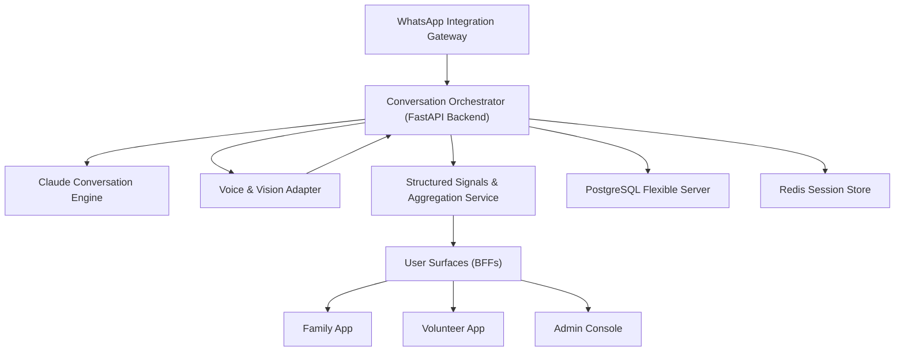

# BRD Response — Saathi (साथी) — The Comforting AI Buddy for Senior Citizens

_Generated 2026-09-11 16:30 UTC · BRD `TMP2HZ0PN4R` · 249 requirements · 41 sections_

## Executive Summary

Saathi is a WhatsApp-accessible, multilingual AI companion designed to provide Indian senior citizens with comforting conversation, health education, and discreet risk identification, while supporting privacy and dignity. The primary business goal is to foster connection, warmth, and safety for seniors, complemented by a human support ecosystem (volunteers, admin console, and family app). The headline constraint is delivering a simple, user-friendly experience across multiple languages and interfaces, with robust privacy and risk management.

**Overall readiness: 🟢 GREEN**

## Quality Scorecard

| Deliverable | Badge | Overall | Complete | Consistent | Actionable | Grounded | Revs |
| --- | :---: | :---: | :---: | :---: | :---: | :---: | :---: |
| Engineering Plan | 🟢 Badge.GREEN | 0.86 | 0.85 | 0.95 | 0.85 | 0.80 | 0 |
| Schedule & Estimates | 🟢 Badge.GREEN | 0.89 | 0.95 | 0.95 | 0.90 | 0.70 | 0 |
| Solution Architecture | 🟢 Badge.GREEN | 0.86 | 0.95 | 0.90 | 0.85 | 0.70 | 0 |
| Proof-of-Concept Plan | 🟢 Badge.GREEN | 0.94 | 0.95 | 0.95 | 0.90 | 0.95 | 0 |
| Technology Stack Options | 🟢 Badge.GREEN | 0.98 | 1.00 | 1.00 | 1.00 | 0.90 | 0 |

---

## Engineering Plan &nbsp;·&nbsp; 🟢 Badge.GREEN

### Phases
| Phase | Objective | Entry criteria | Exit criteria | Deliverables |
| --- | --- | --- | --- | --- |
| Discovery & Design | Establish solution architecture, finalize user journeys for all roles, and validate regulatory and privacy requirements. | BRD and success metrics approved, Access to WhatsApp Business API sandbox, Stakeholder availability for interviews | Signed-off solution architecture (all integrations mapped), Wireframes for Senior, Family, Volunteer, and Admin surfaces, Regulatory requirements (DPDP, TRAI-DLT, Meta) documented with launch gate checklist, Privacy line and data flow diagrams reviewed | Solution architecture document, Wireframes for all user roles, Regulatory and privacy compliance checklist, Language and prompt engineering plan |
| Foundation & Walking Skeleton | Deliver a vertical slice: WhatsApp chat, Claude integration, language selection, and privacy line enforcement for a single language. | Solution architecture and wireframes signed off, Twilio WhatsApp Business API access, Claude API credentials, Azure resources provisioned | Senior can chat with AI buddy via WhatsApp in one language, Language selection flow implemented, Claude conversation engine integrated with native prompt, No raw conversations accessible outside Senior View, Data stored only as transcripts (no raw audio/images) | FastAPI backend skeleton, PostgreSQL Flexible Server schema with Row-Level Security, Redis session memory integration, WhatsApp integration (Twilio), Claude integration (one language), Privacy line enforcement (data access controls) |
| Core Build: Multilingual, Risk Sensing, and Human Ecosystem | Expand to all supported languages, implement risk sensing, education, and human ecosystem (volunteer, family, admin). | Walking skeleton demoed and accepted, Native prompt engineering for all target languages, Azure Speech STT/TTS and AI Vision access | AI buddy supports all required Indian languages (chat, voice, reminders, education), Risk sensing and prevention logic implemented (signals, patterns, no surveillance), Volunteer onboarding and verification (Police Verification Certificate workflow), Family dashboard and Volunteer app functional (aggregate/structured data only), Admin console operational, All surfaces consume events core, no cross-surface dependencies | Language prompt packs (per language, per use case), Azure Speech STT/TTS integration, Azure AI Vision photo understanding (with auto-delete), Volunteer registry and verification module, Family dashboard (signals, reminders, Q&A), Volunteer app (visit management, wellness checks), Admin console (KPI/events/compliance), Aggregate/structured data tables and APIs |
| Hardening: Privacy, Compliance, Accessibility, and Scale | Ensure privacy, compliance, accessibility, and readiness for pilot scale. | Core build features complete, Aggregate/structured data flows validated, All roles functional in staging | Privacy and data retention policies enforced (auto-delete, access controls), Compliance with DPDP, TRAI-DLT, Meta, state language, and welfare mapping, Accessibility audit complete (WCAG 2.1 AA for admin/family/volunteer UIs), Load test to 200+ concurrent seniors, Penetration test and privacy breach simulation passed, No raw audio/images stored; transcripts only | Privacy/data retention automation, Compliance documentation and launch gate signoff, Accessibility audit report, Load and pen test reports, Monitoring dashboards (privacy, compliance, system health) |
| Pilot Launch & Stabilization | Deploy to Mumbai pilot cohort, monitor, and iterate for stability and compliance. | Hardening phase exit criteria met, Pilot cohort recruited and onboarded, Volunteer and admin teams trained | 150+ seniors active in Mumbai pilot, Alert response time ≤10s for emergencies, No privacy breaches or compliance failures, Volunteer verification compliance at 100%, Family engagement metrics tracked | Pilot deployment (Azure Central India), Onboarding/training materials, Pilot monitoring and incident response runbooks, Pilot metrics dashboard, Post-pilot retrospective and lessons learned |

### Risk Register
| Risk | Likelihood | Impact | Mitigation | Owner | Retire by |
| --- | --- | --- | --- | --- | --- |
| Ambiguity in risk sensing and prevention requirements (R006, R007, R016, R028, R030) | high | high | Run focused discovery workshops with stakeholders and legal to define acceptable risk sensing and prevention boundaries without surveillance. | Product Manager | Discovery & Design |
| Multi-language prompt engineering quality and coverage (R003, R024, R025, R026, R053) | medium | high | Hire/contract native prompt engineers per language; run early PoC for each language; iterative user testing. | Engineering Lead | Core Build: Multilingual, Risk Sensing, and Human Ecosystem |
| WhatsApp API migration from Twilio to Meta Cloud API at scale (R048, R049) | medium | medium | Design integration abstraction layer; prototype Meta Cloud API early; plan migration window. | Backend Engineer | Hardening: Privacy, Compliance, Accessibility, and Scale |
| Regulatory compliance (DPDP, TRAI-DLT, Meta, state language, welfare mapping) (R035) | medium | high | Engage compliance/legal early; create compliance checklist; run pre-launch audits. | Compliance Lead | Hardening: Privacy, Compliance, Accessibility, and Scale |
| Privacy line enforcement and data minimization (R014, R040, R041, R042, R055, R057) | medium | high | Architect strict access controls; implement auto-delete and audit logging; privacy reviews. | Security Lead | Hardening: Privacy, Compliance, Accessibility, and Scale |
| Volunteer verification and compliance with Police Verification Certificate (R031, R032, R033) | medium | medium | Automate certificate tracking and suspension; annual renewal reminders; admin dashboard compliance view. | Admin Product Owner | Core Build: Multilingual, Risk Sensing, and Human Ecosystem |
| Ambiguity in comfort, connection, and warmth requirements (R004, R015, R018, R027, R029) | high | medium | Co-design with seniors and caregivers; prototype and test conversational flows; measure qualitative feedback. | UX Lead | Discovery & Design |
| Device compatibility for JioPhone and basic Android (R022, R023) | medium | medium | Test on target devices early; restrict features to WhatsApp-supported capabilities. | QA Lead | Foundation & Walking Skeleton |
| Claude, Azure Speech, and Azure AI Vision availability in Central India region; Twilio/Meta API quotas | medium | high | Pre-allocate quota, monitor usage, and have fallback plans for all critical APIs and cloud services. | Engineering Lead | Core Build: Multilingual, Risk Sensing, and Human Ecosystem |
| Police Verification Certificate process dependency for volunteer onboarding in pilot region | medium | high | Engage with local authorities early, establish escalation contacts, and have backup volunteer pool. | Admin Product Owner | Core Build: Multilingual, Risk Sensing, and Human Ecosystem |
| Timely onboarding of pilot cohort (seniors, volunteers, family) and training | medium | high | Start recruitment and training parallel to Hardening; assign onboarding coordinators. | Engineering Manager | Pilot Launch & Stabilization |
| Legal review timelines and vendor SLAs (Claude, Azure, Twilio, Meta) | medium | high | Lock in legal review and vendor onboarding timelines in project plan; escalate delays early. | Compliance Lead | Hardening: Privacy, Compliance, Accessibility, and Scale |

### Milestones
| Milestone | Target week | Depends on |
| --- | --- | --- |
| Solution Architecture & Regulatory Checklist Signed Off | 4 | Signed-off solution architecture (all integrations mapped), Regulatory and privacy compliance checklist |
| Walking Skeleton Demo (WhatsApp chat, Claude, privacy line, one language) | 8 | Senior can chat with AI buddy via WhatsApp in one language, Claude integration (one language), Privacy line enforcement (data access controls) |
| Core Build Complete (all languages, risk sensing, human ecosystem) | 20 | AI buddy supports all required Indian languages (chat, voice, reminders, education), Risk sensing and prevention logic implemented, Volunteer onboarding and verification (Police Verification Certificate workflow), Family dashboard and Volunteer app functional, Admin console operational |
| Hardening Complete (privacy, compliance, accessibility, scale) | 26 | Privacy and data retention policies enforced (auto-delete, access controls), Compliance documentation and launch gate signoff, Accessibility audit report, Load and pen test reports |
| Pilot Launch (Mumbai, 150 seniors) | 28 | Pilot deployment (Azure Central India), Pilot monitoring and incident response runbooks, Pilot metrics dashboard |

### Team Composition
| Role | Count | Allocation % | Phase |
| --- | --- | --- | --- |
| Engineering Manager | 1 | 100 | All |
| Backend Engineer (FastAPI, PostgreSQL, Redis) | 2 | 100 | All |
| Frontend Engineer (Admin/Family/Volunteer UIs) | 2 | 100 | Core Build: Multilingual, Risk Sensing, and Human Ecosystem, Hardening: Privacy, Compliance, Accessibility, and Scale, Pilot Launch & Stabilization |
| Prompt Engineer (Native, per language) | 3 | 50 | Discovery & Design, Core Build: Multilingual, Risk Sensing, and Human Ecosystem |
| QA Engineer | 1 | 100 | Foundation & Walking Skeleton, Core Build: Multilingual, Risk Sensing, and Human Ecosystem, Hardening: Privacy, Compliance, Accessibility, and Scale, Pilot Launch & Stabilization |
| UX Designer | 1 | 50 | Discovery & Design, Foundation & Walking Skeleton, Core Build: Multilingual, Risk Sensing, and Human Ecosystem |
| Compliance/Privacy Lead | 1 | 50 | Discovery & Design, Hardening: Privacy, Compliance, Accessibility, and Scale, Pilot Launch & Stabilization |
| DevOps/Cloud Engineer (Azure, CI/CD, monitoring) | 1 | 50 | Foundation & Walking Skeleton, Core Build: Multilingual, Risk Sensing, and Human Ecosystem, Hardening: Privacy, Compliance, Accessibility, and Scale, Pilot Launch & Stabilization |
| Legal/Compliance Advisor | 1 | 20 | Discovery & Design, Hardening: Privacy, Compliance, Accessibility, and Scale |

### Requirement Coverage
| Requirement | Phase |
| --- | --- |
| R001 | Foundation & Walking Skeleton |
| R002 | Foundation & Walking Skeleton |
| R003 | Core Build: Multilingual, Risk Sensing, and Human Ecosystem |
| R004 | Discovery & Design |
| R005 | Foundation & Walking Skeleton |
| R006 | Core Build: Multilingual, Risk Sensing, and Human Ecosystem |
| R007 | Core Build: Multilingual, Risk Sensing, and Human Ecosystem |
| R008 | Core Build: Multilingual, Risk Sensing, and Human Ecosystem |
| R009 | Core Build: Multilingual, Risk Sensing, and Human Ecosystem |
| R010 | Core Build: Multilingual, Risk Sensing, and Human Ecosystem |
| R011 | Core Build: Multilingual, Risk Sensing, and Human Ecosystem |
| R012 | Core Build: Multilingual, Risk Sensing, and Human Ecosystem |
| R013 | Core Build: Multilingual, Risk Sensing, and Human Ecosystem |
| R014 | Foundation & Walking Skeleton |
| R015 | Discovery & Design |
| R016 | Core Build: Multilingual, Risk Sensing, and Human Ecosystem |
| R017 | Discovery & Design |
| R018 | Discovery & Design |
| R019 | Foundation & Walking Skeleton |
| R020 | Foundation & Walking Skeleton |
| R021 | Foundation & Walking Skeleton |
| R022 | Foundation & Walking Skeleton |
| R023 | Foundation & Walking Skeleton |
| R024 | Foundation & Walking Skeleton |
| R025 | Core Build: Multilingual, Risk Sensing, and Human Ecosystem |
| R026 | Core Build: Multilingual, Risk Sensing, and Human Ecosystem |
| R027 | Discovery & Design |
| R028 | Core Build: Multilingual, Risk Sensing, and Human Ecosystem |
| R029 | Discovery & Design |
| R030 | Core Build: Multilingual, Risk Sensing, and Human Ecosystem |
| R031 | Core Build: Multilingual, Risk Sensing, and Human Ecosystem |
| R032 | Core Build: Multilingual, Risk Sensing, and Human Ecosystem |
| R033 | Core Build: Multilingual, Risk Sensing, and Human Ecosystem |
| R034 | Hardening: Privacy, Compliance, Accessibility, and Scale |
| R035 | Hardening: Privacy, Compliance, Accessibility, and Scale |
| R036 | Discovery & Design |
| R037 | Discovery & Design |
| R038 | Discovery & Design |
| R039 | Discovery & Design |
| R040 | Foundation & Walking Skeleton |
| R041 | Foundation & Walking Skeleton |
| R042 | Core Build: Multilingual, Risk Sensing, and Human Ecosystem |
| R043 | Core Build: Multilingual, Risk Sensing, and Human Ecosystem |
| R044 | Core Build: Multilingual, Risk Sensing, and Human Ecosystem |
| R045 | Core Build: Multilingual, Risk Sensing, and Human Ecosystem |
| R046 | Foundation & Walking Skeleton |
| R047 | Foundation & Walking Skeleton |
| R048 | Foundation & Walking Skeleton |
| R049 | Hardening: Privacy, Compliance, Accessibility, and Scale |
| R050 | Core Build: Multilingual, Risk Sensing, and Human Ecosystem |
| R051 | Core Build: Multilingual, Risk Sensing, and Human Ecosystem |
| R052 | Core Build: Multilingual, Risk Sensing, and Human Ecosystem |
| R053 | Core Build: Multilingual, Risk Sensing, and Human Ecosystem |
| R054 | Core Build: Multilingual, Risk Sensing, and Human Ecosystem |
| R055 | Foundation & Walking Skeleton |
| R056 | Core Build: Multilingual, Risk Sensing, and Human Ecosystem |
| R057 | Core Build: Multilingual, Risk Sensing, and Human Ecosystem |
| R058 | Foundation & Walking Skeleton |
| R059 | Foundation & Walking Skeleton |
| R060 | Foundation & Walking Skeleton |

### Assumptions
- Seniors have access to WhatsApp on their device (Android or JioPhone).
- Claude, Azure Speech, and Azure AI Vision are available in Central India region.
- Native prompt engineers for all supported languages can be contracted.
- Police Verification Certificate process is operational in pilot region.
- No requirement for video or image storage beyond short-term processing.
- Family, Volunteer, and Admin users have smartphones and internet access.
- The system must treat seniors as givers of wisdom, not recipients of pity. (R018, assumption, must)
- Connection must be the primary product of the system. (R029, assumption, must)
- Saathi must run on Azure in the Central India region. (R046, constraint, must)

### Out of Scope
- Any in-person support not verified by Police Verification Certificate.
- Diagnosis or prescription of medical treatments.
- Handling of user funds or financial transactions.
- Storing or sharing of raw audio, images, or video.
- Direct access to raw conversation data by any role except the senior.
- The system must never diagnose users. (R036, constraint, must)
- The system must never prescribe treatments or medications. (R037, constraint, must)
- The system must never handle money without explicit confirmation. (R038, constraint, must)
- The system must never share exact addresses. (R039, constraint, must)
- The system must never store images or raw voice data. (R040, constraint, must)

_Grounding: `KB:engineering_plan_template.md#0`, `KB:partner_portal_delivery.md#0`_

---

## Schedule & Estimates &nbsp;·&nbsp; 🟢 Badge.GREEN

✅ aligned to the plan's phases

### Effort by Phase
| Phase | Person-weeks | Confidence |
| --- | --- | --- |
| Discovery & Design | 8 | optimistic: 6–7 pw, likely: 8 pw, pessimistic: 10–11 pw |
| Foundation & Walking Skeleton | 13 | optimistic: 10–11 pw, likely: 13 pw, pessimistic: 15–16 pw |
| Core Build: Multilingual, Risk Sensing, and Human Ecosystem | 32 | optimistic: 26–28 pw, likely: 32 pw, pessimistic: 38–40 pw |
| Hardening: Privacy, Compliance, Accessibility, and Scale | 12 | optimistic: 9–10 pw, likely: 12 pw, pessimistic: 14–15 pw |
| Pilot Launch & Stabilization | 7 | optimistic: 5–6 pw, likely: 7 pw, pessimistic: 8–9 pw |
| Contingency | 11 | 15–20% of total build effort; included in total below |

### Timeline
| Phase | Start week | End week | Parallel with |
| --- | --- | --- | --- |
| Discovery & Design | 1 | 3 | — |
| Foundation & Walking Skeleton | 4 | 7 | — |
| Core Build: Multilingual, Risk Sensing, and Human Ecosystem | 8 | 17 | — |
| Hardening: Privacy, Compliance, Accessibility, and Scale | 18 | 21 | — |
| Pilot Launch & Stabilization | 22 | 24 | — |

### Resource Allocation
| Role | Phase | Allocation % |
| --- | --- | --- |
| Engineering Manager | All | 100 |
| Backend Engineer (FastAPI, PostgreSQL, Redis) | All | 100 |
| Frontend Engineer (Admin/Family/Volunteer UIs) | Core Build: Multilingual, Risk Sensing, and Human Ecosystem | 100 |
| Frontend Engineer (Admin/Family/Volunteer UIs) | Hardening: Privacy, Compliance, Accessibility, and Scale | 100 |
| Frontend Engineer (Admin/Family/Volunteer UIs) | Pilot Launch & Stabilization | 100 |
| Prompt Engineer (Native, per language) | Discovery & Design | 50 |
| Prompt Engineer (Native, per language) | Core Build: Multilingual, Risk Sensing, and Human Ecosystem | 50 |
| QA Engineer | Foundation & Walking Skeleton | 100 |
| QA Engineer | Core Build: Multilingual, Risk Sensing, and Human Ecosystem | 100 |
| QA Engineer | Hardening: Privacy, Compliance, Accessibility, and Scale | 100 |
| QA Engineer | Pilot Launch & Stabilization | 100 |
| UX Designer | Discovery & Design | 50 |
| UX Designer | Foundation & Walking Skeleton | 50 |
| UX Designer | Core Build: Multilingual, Risk Sensing, and Human Ecosystem | 50 |
| Compliance/Privacy Lead | Discovery & Design | 50 |
| Compliance/Privacy Lead | Hardening: Privacy, Compliance, Accessibility, and Scale | 50 |
| Compliance/Privacy Lead | Pilot Launch & Stabilization | 50 |
| DevOps/Cloud Engineer (Azure, CI/CD, monitoring) | Foundation & Walking Skeleton | 50 |
| DevOps/Cloud Engineer (Azure, CI/CD, monitoring) | Core Build: Multilingual, Risk Sensing, and Human Ecosystem | 50 |
| DevOps/Cloud Engineer (Azure, CI/CD, monitoring) | Hardening: Privacy, Compliance, Accessibility, and Scale | 50 |
| DevOps/Cloud Engineer (Azure, CI/CD, monitoring) | Pilot Launch & Stabilization | 50 |
| Legal/Compliance Advisor | Discovery & Design | 20 |
| Legal/Compliance Advisor | Hardening: Privacy, Compliance, Accessibility, and Scale | 20 |

**Critical path:** Discovery & Design: Regulatory/privacy mapping, user journeys, language/prompt plan → Foundation & Walking Skeleton: WhatsApp/Claude integration, privacy line, session/data model → Core Build: Multilingual expansion, risk sensing, volunteer/family/admin surfaces, aggregate data flows → Hardening: Privacy/retention automation, compliance, accessibility, load/pen test → Pilot Launch: Deployment, onboarding, monitoring, incident response
**Contingency:** 18%
**Total calendar weeks:** optimistic 20 · likely 24 · pessimistic 28

_Grounding: `KB:partner_portal_delivery.md#0`, `KB:estimation_heuristics.md#0`, `KB:nfr_catalog.md#0`, `KB:legacy_billing_export_delivery.md#0`_

---

## Solution Architecture &nbsp;·&nbsp; 🟢 Badge.GREEN

Saathi is an AI-powered WhatsApp companion for Indian senior citizens, delivering comforting conversation, health education, and discreet risk identification in multiple Indian languages. Seniors interact via WhatsApp (Twilio WhatsApp Business API for pilot, Meta Cloud API at scale), with voice and photo support through Azure Speech STT/TTS and Azure AI Vision. The Claude conversation engine provides AI responses using native prompt engineering. Human support is enabled through volunteer, admin, and family interfaces, all served from a FastAPI backend on Azure (Central India), with PostgreSQL (row-level security) and Redis for session memory. Strict privacy ensures only seniors see raw conversations, while other roles access only structured signals and patterns. Regulatory, privacy, and cultural requirements (DPDP, TRAI-DLT, Meta, language tiers) are enforced.

### Components
| Component | Responsibility | Area | Interfaces |
| --- | --- | --- | --- |
| WhatsApp Integration Gateway | Handles inbound/outbound WhatsApp messages via Twilio/Meta APIs, normalizes events for backend. | integration | Twilio WhatsApp Business API, Meta Cloud API, REST (to FastAPI backend) |
| Voice & Vision Adapter | Processes voice (STT/TTS) and image (AI Vision) requests/responses, ensures deletion policies. | integration | Azure Speech STT/TTS, Azure AI Vision, REST (to FastAPI backend) |
| Conversation Orchestrator (FastAPI Backend) | Core business logic: routes messages, manages sessions, enforces privacy, triggers AI, aggregates signals. | service | REST (from WhatsApp Gateway, Voice & Vision Adapter, UI BFFs), Claude API, PostgreSQL, Redis |
| Claude Conversation Engine | Generates AI responses using per-language, per-role prompts. | integration | Claude API (REST), REST (from Conversation Orchestrator) |
| Structured Signals & Aggregation Service | Transforms raw conversations into structured signals, risk patterns, and aggregates for non-senior roles. | service | Internal API (from Conversation Orchestrator), REST (to BFFs for Family, Volunteer, Admin) |
| User Surfaces (BFFs) | Backend-for-frontend APIs for Family App, Volunteer App, and Admin Console; enforce role-based access and data shaping. | service | REST (to web/mobile clients), REST (from Structured Signals Service, Conversation Orchestrator) |
| PostgreSQL Flexible Server | Stores transcripts (senior-only), structured signals, user profiles, role assignments, audit logs; row-level security enforced. | datastore | SQL (from Conversation Orchestrator, Structured Signals Service) |
| Redis Session Store | Maintains ephemeral session memory for ongoing conversations. | datastore | Redis protocol (from Conversation Orchestrator) |

### Data Flows
| From | To | Data | Protocol | Mode |
| --- | --- | --- | --- | --- |
| Senior (WhatsApp client) | WhatsApp Integration Gateway | Text, voice notes, images | http | sync |
| WhatsApp Integration Gateway | Conversation Orchestrator | Normalized message events | http | sync |
| Conversation Orchestrator | Voice & Vision Adapter | Audio or image payloads for STT/TTS or Vision | http | sync |
| Voice & Vision Adapter | Conversation Orchestrator | Transcripts, TTS audio, image understanding results | http | sync |
| Conversation Orchestrator | Claude Conversation Engine | Prompt (with context, language, role) | http | sync |
| Claude Conversation Engine | Conversation Orchestrator | AI-generated response | http | sync |
| Conversation Orchestrator | Structured Signals & Aggregation Service | Conversation metadata, risk signals, patterns | http | async |
| Structured Signals & Aggregation Service | User Surfaces (BFFs) | Aggregated signals, patterns, structured notes | http | sync |
| User Surfaces (BFFs) | Family/Volunteer/Admin Apps | Signals, patterns, structured notes (never raw conversations) | http | sync |
| Conversation Orchestrator | PostgreSQL Flexible Server | Transcripts (senior-only), user profiles, audit logs | sql | sync |
| Structured Signals & Aggregation Service | PostgreSQL Flexible Server | Structured signals, aggregates | sql | sync |
| Conversation Orchestrator | Redis Session Store | Session state | redis | sync |

### Integrations
| System | Direction | Method |
| --- | --- | --- |
| Twilio WhatsApp Business API | inbound | Webhook (HTTP) |
| Meta Cloud API | inbound | Webhook (HTTP) |
| Claude (conversation engine) | outbound | REST API |
| Azure Speech STT/TTS | outbound | REST API |
| Azure AI Vision | outbound | REST API |
| Azure (Central India) | bidirectional | Platform hosting, managed identity, Key Vault, monitoring |

### NFR Mapping
| NFR | Requirement IDs | Tactic | Verification |
| --- | --- | --- | --- |
| Usability / Accessibility | R001, R003, R020, R021, R022, R023, R024, R025, R026 | WhatsApp as primary interface, native prompt engineering, device/browser testing, per-language onboarding, design system for BFFs, cultural framing | Manual UX audit on target devices (Android, JioPhone), language QA, accessibility audit, pilot feedback |
| Performance | R002, R019, R054, R056 | Async offload for STT/TTS/Vision, right-sized worker pools, Redis for session, p95 < 2.5s for user interactions | Load test with 200 concurrent users, measure p95/p99 response times |
| Scalability | R048, R049, R052 | Stateless services, autoscale on Azure Container Apps, event-driven aggregation, migration path for WhatsApp API | Scale test to 3x pilot load, validate migration to Meta Cloud API |
| Availability | R002, R019, R052 | Multi-replica backend, health probes, retries, no single point of failure on critical path | Failover test, chaos engineering, monitor uptime |
| Security | R014, R030, R034, R035, R040, R041, R042, R046, R055, R057, R059, R060 | Row-level security, role-based access, managed identities, encrypted at rest/in transit, Key Vault for secrets, audit logs, image/audio deletion, DPDP/TRAI compliance | Pen test, security review, audit log review, compliance checklists, data retention test |
| Compliance (DPDP, TRAI-DLT, Meta, audit, retention) | R035, R046, R055, R057, R059 | Data lifecycle policies, explicit retention, audit trails, regional hosting, regulatory launch gates | Compliance audit, data deletion test, regulatory signoff |

### Key Decisions
- **WhatsApp as the sole senior interface (no new app/UI for seniors)** — Meets zero-install, zero-learning-curve, and device compatibility requirements (R020, R021, R022, R023). _(rejected: Custom mobile app, Web portal for seniors)_
- **Strict separation of raw conversations and signals/aggregates for non-senior roles** — Enforces privacy (R014, R041, R042), prevents accidental leakage, and supports regulatory compliance. _(rejected: Role-based filtering at query time, Raw data access for admins)_
- **Native prompt engineering per language for Claude** — Ensures cultural and linguistic appropriateness (R026, R053), avoids translation artifacts. _(rejected: Automated translation layer, Single-language prompt with translation)_
- **Ephemeral processing and deletion of images/audio** — Meets privacy and compliance constraints (R040, R055, R057), minimizes risk. _(rejected: Storing raw media, Retaining images for audit)_
- **Backend-for-frontend pattern for Family, Volunteer, and Admin apps** — Allows tailored data shaping, role-based access, and separation of concerns (see architecture patterns catalogue: Backend-for-frontend). _(rejected: Single monolithic API for all roles, Direct DB access from apps)_

### Diagram

_Grounding: `KB:architecture_patterns.md#0`, `KB:nfr_catalog.md#0`, `KB:security_baseline.md#0`_

---

## Proof-of-Concept Plan &nbsp;·&nbsp; 🟢 Badge.GREEN

**Goal:** Can the Claude Conversation Engine generate culturally appropriate, comforting, and contextually relevant responses in Hindi and Tamil (the two highest-priority non-English languages) with a user-rated comfort score ≥ 4/5 in a simulated WhatsApp conversation, using native prompt engineering?

### Hypotheses
- Claude, with native prompt engineering per language, can produce responses in Hindi and Tamil that senior users rate as ≥ 4/5 for comfort, warmth, and contextual relevance in a WhatsApp-like chat.

### In Scope
- WhatsApp-like text conversation simulation (no real WhatsApp integration; use a simple web or CLI chat interface).
- Claude Conversation Engine integration with per-language, per-role prompts (Hindi, Tamil, English).
- Basic session management (single conversation thread, ephemeral memory).
- User comfort/relevance rating collection after each response.
- Test with 5–10 native speakers per language (Hindi, Tamil).

### Out of Scope
- Actual WhatsApp/Twilio/Meta API integration.
- Voice (STT/TTS) and image (AI Vision) flows.
- Full privacy, compliance, or audit logging.
- Production-grade session management or persistence.
- Family, Volunteer, or Admin user surfaces.
- Risk signal extraction or aggregation.
- Accessibility, device compatibility, or JioPhone testing.
- Automated translation or fallback to English.
- Full NFR/performance/load testing.
- Auth, onboarding, or user management.

### Modules
| Module | Maps to component | Boundary | Interfaces | Collaborators |
| --- | --- | --- | --- | --- |
| Claude Conversation Engine | Claude Conversation Engine | REST API call to Claude with per-language prompt and message history | Claude API (REST) | real |
| Conversation Orchestrator (PoC) | Conversation Orchestrator (FastAPI Backend) | Routes user messages to Claude, manages ephemeral session, collects ratings | Simple chat UI (web/CLI), Claude API (REST) | real |

### Success Criteria
| Metric | Threshold | Measurement method |
| --- | --- | --- |
| User-rated comfort/warmth/relevance score (Likert 1–5) per response | ≥ 4.0 average across all Hindi and Tamil test users (n ≥ 5 per language) | Collect rating after each response in simulated chat; compute average per language |

**Duration:** 2 weeks · resources: role: Backend Engineer; count: 1, role: Prompt Engineer (Hindi); count: 1, role: Prompt Engineer (Tamil); count: 1, role: Test Participants (Hindi, Tamil); count: 10

### Exit Decision Matrix
| Outcome | Decision |
| --- | --- |
| all criteria met | Proceed with full multilingual build and native prompt engineering for additional languages. |
| partially met | Iterate on prompt engineering and/or adjust language rollout plan; consider fallback translation for lower-performing languages. |
| not met | Re-scope: reconsider Claude as LLM, prompt approach, or language support strategy before full build. |

_Grounding: `KB:poc_template.md#0`, `KB:architecture_template.md#0`, `KB:engineering_plan_template.md#0`_

---

## Technology Stack Options &nbsp;·&nbsp; 🟢 Badge.GREEN

### Option: Boring Monolith with Managed Azure Services — _Single FastAPI monolith (containerized) handling all orchestration, integrations, and BFFs, with managed Azure services for data and messaging._

| Layer | Choice |
| --- | --- |
| language | Python 3.11+ |
| framework | FastAPI (monolith, all endpoints and integrations in one codebase) |
| datastore | PostgreSQL Flexible Server (row-level security), Redis (Azure Cache for Redis) |
| infra | Azure Container Apps (single service), Azure Blob for temp image/voice, Azure Key Vault, Managed Identity |
| ci_cd | GitHub Actions (lint, test, scan, deploy to staging/prod), Terraform/Bicep for IaC |
| observability | Azure Monitor (logs, metrics, traces), Sentry for error tracking |

| Dimension | Score (1–5) |
| --- | --- |
| scalability | 4 |
| team_familiarity | 5 |
| integration_risk | 5 |
| cost | 4 |
| time_to_market | 5 |

_Trade-offs:_ Simple, fast to build, and aligns with org ADOPT stack and BRD constraints. All integrations and BFFs are in one codebase, reducing cross-service complexity and easing privacy enforcement. However, as traffic and features grow, the monolith may become harder to scale or split, and deployments are all-or-nothing. Some risk of codebase bloat as more roles and integrations are added.
_Best when:_ Pilot and early scale, when rapid delivery, privacy, and team familiarity are paramount, and the system is evolving quickly.

### Option: Service-Oriented (Integration Gateways + Core Orchestrator) — _Separate containerized services for WhatsApp Gateway, Voice/Vision Adapter, and Core Orchestrator, each deployed independently. BFFs as thin FastAPI services per surface._

| Layer | Choice |
| --- | --- |
| language | Python 3.11+ (all services) |
| framework | FastAPI (per service: WhatsApp Gateway, Voice/Vision Adapter, Orchestrator, BFFs) |
| datastore | PostgreSQL Flexible Server (shared, strict RLS), Redis (shared session store) |
| infra | Azure Container Apps (multiple services), Azure Blob for temp storage, Azure Key Vault, Managed Identity |
| ci_cd | GitHub Actions (multi-service pipelines, IaC with Terraform/Bicep) |
| observability | Azure Monitor (logs, metrics, distributed traces), Sentry |

| Dimension | Score (1–5) |
| --- | --- |
| scalability | 5 |
| team_familiarity | 4 |
| integration_risk | 4 |
| cost | 3 |
| time_to_market | 3 |

_Trade-offs:_ Clear separation of concerns and strong boundaries for privacy enforcement (e.g., WhatsApp Gateway cannot see signals, Orchestrator cannot see raw images/voice). Each service can be scaled and deployed independently. However, higher operational complexity, more moving parts, and slower initial delivery. Slightly higher integration risk due to inter-service contracts. Cost is higher due to more containers and infra overhead.
_Best when:_ When anticipating rapid scale, regulatory scrutiny, or needing to isolate sensitive integrations for compliance or operational reasons.

### Option: Low-Ops/Serverless-Heavy (Azure Functions for Integration, Orchestrator as Container App) — _Azure Functions for WhatsApp, Voice, and Vision adapters (event-driven), with a central FastAPI Orchestrator in Container Apps. BFFs as Functions or lightweight containers._

| Layer | Choice |
| --- | --- |
| language | Python 3.11+ |
| framework | FastAPI (core orchestrator), Azure Functions (integration points, BFFs) |
| datastore | PostgreSQL Flexible Server, Redis (Azure Cache for Redis) |
| infra | Azure Functions (consumption plan), Azure Container Apps (orchestrator), Azure Blob, Key Vault, Managed Identity |
| ci_cd | GitHub Actions (deploy Functions and containers, IaC with Terraform/Bicep) |
| observability | Azure Monitor (App Insights for Functions, logs/metrics), Sentry |

| Dimension | Score (1–5) |
| --- | --- |
| scalability | 5 |
| team_familiarity | 3 |
| integration_risk | 3 |
| cost | 5 |
| time_to_market | 3 |

_Trade-offs:_ Minimizes ops overhead and scales to zero for infrequent workloads (e.g., image/voice processing). Functions are well-suited for event-driven integrations (e.g., WhatsApp webhooks, image deletion timers). However, team is less familiar with Functions for complex flows, and debugging distributed serverless can be challenging. Integration risk is higher due to event-driven async patterns and cold start latency. Best for cost at low/variable scale.
_Best when:_ When minimizing operational burden and cost is critical, and the team is comfortable with Azure Functions for glue code and integrations.

### Recommendation
**Boring Monolith with Managed Azure Services** — The dominant constraint is rapid delivery of a simple, privacy-respecting, multi-interface system with robust privacy boundaries and minimal integration risk. The monolith approach is fastest to market, easiest for the team (who are already familiar with FastAPI, Azure Container Apps, and managed Postgres/Redis), and simplifies privacy enforcement (all logic in one place). It also aligns with the organization's ADOPT stack and past successful deliveries (e.g., Partner Portal). Service boundaries can be introduced later as scale or compliance needs dictate.

_Dominant constraint:_ Time-to-market and privacy enforcement for a user-friendly, multi-interface system.

_Grounding: `KB:tech_radar.md#0`, `KB:partner_portal_delivery.md#0`, `KB:nfr_catalog.md#0`_
